# Churn Prediction Machine Learning Model

Created by: Mohammad Fauzan

## Contents

- [Prerequisites](#prerequisites)
- [Library and Version](#library-and-version)
- [EDA](#eda)
- [Data Visualization](#data-visualization)
- [Feature Engineering](#feature-engineering)
- [Data Preprocessing](#data-preprocessing)
- [Modeling](#modeling)

## Prerequisites
1. Download data [here](https://www.kaggle.com/datasets/blastchar/telco-customer-churn/data)
2. Clone this repository:
   ```bash
   git clone https://github.com/Podjan/ChurnPorto
   ```

## Library and Version
- Numpy: 1.26.4
- Pandas: 2.2.2
- Matplotlib.pyplot: 3.8.4
- Seaborn: 0.13.2
- Scikit-learn: 1.4.2

## EDA
Before we start on EDA, we need to make sure the data type from each column is correct. As we can see from image below, Totalcharges column type is object. 

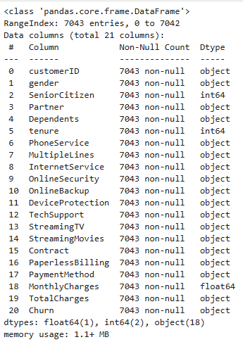

We need to change that to float or integer by using:
```python
df['TotalCharges'].replace({' ': np.nan}, inplace=True)
df['TotalCharges'] = df['TotalCharges'].astype(float)
df.dtypes
```
From image below, mean for tenure is more than its median, so the distribution for tenure is right skewed. The same can be said for TotalCharges. But, MonthlyCharges showed us differently, the median is higher than its mean.

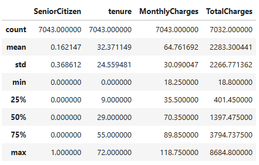

We can see the distribution more clearly with histogram. For tenure, after the trend is lower and become stagnan, in tenure 70, there is a big increase. MonthlyCharges has interesting shape. Even though the monthly charge that has the most customers is 20, from the trend line there is an increase up to a monthly charge of 80. At a glance, this can show that the monthly income of customers is middle class because they can pay monthly fees in the middle range too.

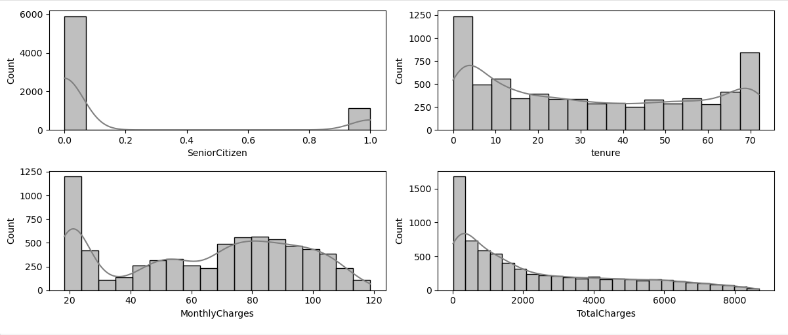

For outliers, from the boxplot in the image below we can see that there are no outliers in our dataset.

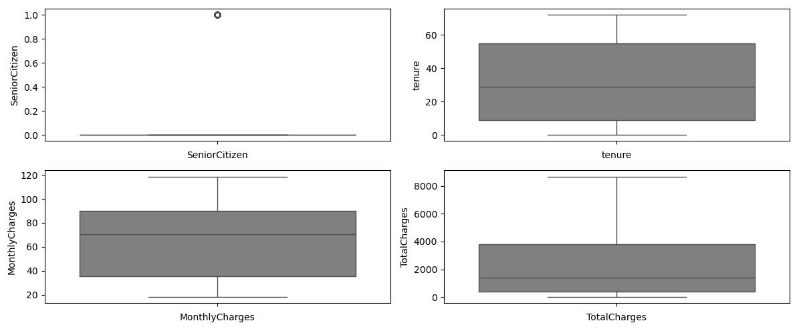

We can see the details of the data in the object type columns using countplot. Since there are so many, I will skip explaining this part. The code is below:

```python
import seaborn as sns
import matplotlib.pyplot as plt

cats = cats.drop(columns=['customerID'])

cat_columns = cats.columns

plt.figure(figsize=(18, 5 * ((len(cat_columns) + 2) // 3)))
for i in range(len(cat_columns)):
    plt.subplot((len(cat_columns) + 2) // 3, 3, i + 1)
    sorted_order = df[cat_columns[i]].value_counts().index
    sns.countplot(x=df[cat_columns[i]], hue=df[cat_columns[i]], order=sorted_order, palette='gray', legend=False)
    plt.xlabel(cat_columns[i])
    plt.tight_layout()
```

## Data Visualization

The code for visualization categorical columns is below

```python
import matplotlib.pyplot as plt
import seaborn as sns

target = 'Churn'

# Only categorical
categorical_features = df2.select_dtypes(include=['object']).columns.tolist()

# Loop 
for feature in categorical_features:
    plt.figure(figsize=(6, 4))
    sorted_order = df2[feature].value_counts().index
    sns.countplot(x=df2[feature], hue=df2[target])

    # Styling
    plt.title(f'{feature} Distribution Based on {target}')
    plt.xlabel(feature)
    plt.ylabel('Quantity')
    plt.xticks(rotation=45)
    
    
    plt.show()
```

While for MonthlyCharges:

```python
import matplotlib.pyplot as plt
import seaborn as sns

plt.figure(figsize = (10,7))
sns.histplot(data = df2, x='MonthlyCharges', hue ='Churn', kde = True, fill = True)

plt.title('Monthy Charge Distribution')
plt.xlabel('Monthly Charge')
plt.ylabel('Quantity')

plt.show()
```

From the graph below, it can be seen that high monthly fees will not necessarily make people stop subscribing. But at a monthly fee of 70, there is an increase in people who stop using our service and those who stop are more than those who don't stop. Then this figure tends to remain the same even though it is decreasing. Starting from a monthly fee above 100, the number of people who stop starts to decrease a lot.

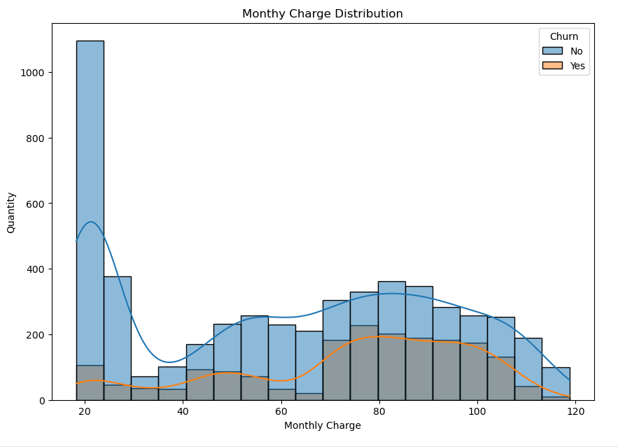

## Feature Engineering

Using `df.isna().sum()`, We can see that there are 11 rows in the totalcharge column that have no value. We can drop those rows.

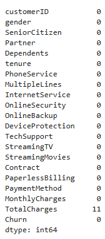

Previously, we knew the distribution of continuous numerical columns and we also knew that there were no outliers. Therefore, we transform the distribution using the log function.

```python
log_columns = ['tenure', 'MonthlyCharges', 'TotalCharges']

for col in log_columns:
    df[col + '_log'] = np.log(df[col] + 1)
```

After that, we can drop the old columns using `df.drop(columns=log_columns, inplace=True)`. 

To prevent double counting data when encoding labels, we will perform category consolidation. Why? For example, we have these columns with their own categories:
1. InternetService
- DLS
- Fiber Optic
- No
2. OnlineSecurity
- Yes
- No
- No Internet Service

And if we use One-hot Encoding, the result will be like this:
| InternetService_DSL | InternetService_FiberOptic | InternetService_No | OnlineSecurity_Yes | OnlineSecurity_No | OnlineSecurity_NoInternetService |
|---------------------|---------------------------|---------------------|--------------------|-------------------|------------------------------|
| 1                   | 0                           | 0                   | 1                  | 0                 | 0                            |
| 0                   | 1                           | 0                   | 0                  | 1                 | 0                            |
| 0                   | 0                           | 1                   | 0                  | 0                 | 1                            |

The problem is, if `InternetService_No` = 1, then definitely `OnlineSecurity_NoInternetService` = 1 too. This is what is called double counting. We can overcome this with category consolidation, by combining categories. So we could say this is a merging process.

We can check what columns we want to handle with the code:

```python
def check_column_values(df):
    for column in df.columns:
        print(f"coloumn: {column}")
        print(f"data: {df[column].unique()}")
        print("-" * 50)
        
check_column_values(df) 
```

After that, we can do merging:

```python
df['MultipleLines'] = df['MultipleLines'].replace('No phone service', 'No')
df['InternetService'] = df['InternetService'].replace('DSL', 'Yes')
df['InternetService'] = df['InternetService'].replace('Fiber optic', 'Yes')
df['OnlineSecurity'] = df['OnlineSecurity'].replace('No internet service', 'No')
df['OnlineBackup'] = df['OnlineBackup'].replace('No internet service', 'No')
df['DeviceProtection'] = df['DeviceProtection'].replace('No internet service', 'No')
df['TechSupport'] = df['TechSupport'].replace('No internet service', 'No')
df['StreamingTV'] = df['StreamingTV'].replace('No internet service', 'No')
df['StreamingMovies'] = df['StreamingMovies'].replace('No internet service', 'No')
```

For label encoding, we use 2 methods. One-hot encoding for **nominal** categorical columns, Label Encoder for **ordinal** categorical columns.

**One-hot encoding:**
```python
from sklearn.preprocessing import LabelEncoder

cats_columns = ['Contract', 'PaymentMethod']

# One-hot encoding
df = pd.get_dummies(df, columns=cats_columns, drop_first=True)
```

**Label Encoder:**
```python
# Ordinal
from sklearn.preprocessing import LabelEncoder

ordinal_columns = ['gender', 'SeniorCitizen', 'Partner', 'Dependents', 
    'PhoneService', 'MultipleLines', 'InternetService', 
    'OnlineSecurity', 'OnlineBackup', 'DeviceProtection', 
    'TechSupport', 'StreamingTV', 'StreamingMovies', 'PaperlessBilling', 'Churn']

# Initialize LabelEncoder
label_encoder = LabelEncoder()

# Looping to do Label Encoding
for column in ordinal_columns:
    # Fit dan transform data
    df[column] = label_encoder.fit_transform(df[column])
```

After that, we change the data type from bool to integer
```python
for col in df.columns:
    if df[col].dtype in ['bool', 'int32']:
        df[col] = df[col].astype('int64')
```

For feature selection, we will try to use all the features. The challenge of course is multicollinearity and there may also be some features that are not important. As can be seen in the table below, there are several features that have very high multicollinearity (vif more than 10). But this is okay because we will try to use a model that is not too concerned with multicollinearity.

| feature                                 | VIF         |
|-----------------------------------------|------------:|
| gender                                  | 2.019639    |
| SeniorCitizen                           | 1.369416    |
| Partner                                 | 2.808293    |
| Dependents                              | 1.956508    |
| PhoneService                            | 19.708718   |
| MultipleLines                           | 2.319317    |
| InternetService                         | 25.092404   |
| OnlineSecurity                          | 1.943975    |
| OnlineBackup                            | 2.053756    |
| DeviceProtection                        | 2.242020    |
| TechSupport                             | 2.058900    |
| StreamingTV                             | 2.672104    |
| StreamingMovies                         | 2.726296    |
| PaperlessBilling                        | 2.961871    |
| Churn                                   | 1.929477    |
| tenure_log                              | 1311.869818 |
| MonthlyCharges_log                      | 986.425997  |
| TotalCharges_log                        | 4554.679977 |
| Contract_One year                       | 2.062457    |
| Contract_Two year                       | 3.118387    |
| PaymentMethod_Credit card (automatic)   | 1.976764    |
| PaymentMethod_Electronic check          | 2.980387    |
| PaymentMethod_Mailed check              | 2.273373    |

## Data Preprocessing

There is one more step before we enter the modeling step, which is data preprocessing. First we will check the proportions of our data. As can be seen in the image below, the proportion of churn is not equal. This is a class imbalance and we will fix it.

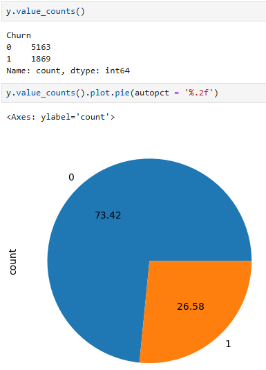

We determine x and y first. Don't forget to save the customerID.
```python
# Features
X = df[['gender', 'SeniorCitizen', 'Partner', 'Dependents',
       'PhoneService', 'MultipleLines', 'InternetService', 'OnlineSecurity',
       'OnlineBackup', 'DeviceProtection', 'TechSupport', 'StreamingTV',
       'StreamingMovies', 'PaperlessBilling', 'tenure_log',
       'MonthlyCharges_log', 'TotalCharges_log', 'Contract_One year',
       'Contract_Two year', 'PaymentMethod_Credit card (automatic)',
       'PaymentMethod_Electronic check', 'PaymentMethod_Mailed check']]

# Target
y = df['Churn']

# save customerID
df_id = df[["customerID"]].copy()
```

After that, we separate it into train and test data.

```python
from sklearn.model_selection import train_test_split
X_train, X_test, y_train, y_test = train_test_split(X, y, test_size=0.2, random_state=42, stratify=y)
```

After that, we correct the imbalance data for the training data. The method is SMOTE. With this method, we carry out oversampling, thereby increasing the number of data samples for the previously under-sampled class to balance it with the other class.

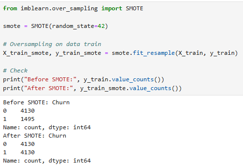

## Modeling

For full code you can open the churnport file.

### Evaluation

In this Churn case, we do classification. We want to know which class our customers fall into. There are four classes, namely, True Positive, True Negative, False Positive, and False Negative. In short, True Positive and True Negative are the results of accurate predictions with the original conditions, while False Positive and False Negative are inaccurate predictions. To find out, there are several evaluation metrics and we choose which metrics are our benchmark based on our case (churn case). There are:

- Accuracy: (True Positive + True Negative)/Total. This is used if True Positive and True Negative are equally important in our case.
- Precision: True Positive / (True Positive + False Positive). Here we want to focus on accurate predictions according to our targets with reality.
- Recall: True Positive / (True Positive - False Negative). We want to reduce false negatives as much as possible in our cases.

We want to reduce false negatives as much as possible in our case. For the Churn case, the evaluation method we use is Recall. Why? We consider churn as a target, meaning churn is positive. We want to minimize customers churn, therefore we have to predict people who will churn. So the true positive is our prediction of churn and the customers churn. The false positive is our prediction of churn but in reality they do not churn. The true negative is our prediction of not churn and the customers do not churn. The false negative is our prediction of customers not churn but in reality the customers churn.

So in recall it means `our prediction of churn and the customers churn / (our prediction of churn and the customers churn - our prediction of customers not churn but in reality the customers churn)`. We want a little false negative in our prediction, it is better for our customers to churn but in reality they do not churn than for us to predict not to churn but in reality they do churn, which means we lose customers. That's why we choose recall as our evaluation metric.

There are two other evaluation metrics that will help:
- F1 score: Useful for balancing precision and recall.
- ROC (AUC): Useful for seeing how well the model distinguishes between two classes (churn or not churn).

Because we focus on reducing false negatives, the F1 score is not our benchmark in the evaluation. While ROC (AUC) can help us in this case.

#### Models

Previously, we already know that there are several columns/features that are affected by multicollinearity problems. Because we still use these features, of course our model must be able to overcome or ignore the multicollinearity. We use four models:
- Logistic Regression. Because logistic regression is sensitive to multicollinearity, we will give a penalty of l1 (lasso) or l2 (ridge) with the saga solver.
- K-Nearest Neighbor (KNN). This model is not very sensitive to multicollinearity, but can still be affected by it.
- Decision Tree. This model is not affected by multicollinearity because it selects features through separation first. But this model is prone to overfitting.
- Random Forest. A more complex version of Decision Tree. Think of Decision Tree as a tree, and Random Forest as a forest. Random Forest will take the average information from all trees. Its accuracy exceeds decision tree. But the process is very long.
- Boosting: This model uses Decision Tree as the base model. In short, this model continues to improve the previous model (tree). Just like Random Forest, this model is also a long process and difficult to interpret.

The results of those models are:

| Model               | Recall (Test Set) | Recall (Train Set) |
|---------------------|------------------|-------------------|
| Logistic Regression | 0.81             | 0.84             |
| KNN                | 0.67             | 0.95             |
| Decision Tree      | 0.72             | 0.80             |
| Random Forest      | 0.64             | 1.00             |
| XGBoost           | 0.73             | 0.90             |

From the table above, Logistic Regression is the best model with a recall of 0.81. The model is also not too overfitting (very small). With this, we can focus on the Logistic Regression model only.

If we look at the ROC-AUC curve, our model is quite good at distinguishing classes, with a score of 0,83. We can create the curve with the following code:
```python
from sklearn.metrics import roc_curve, roc_auc_score

# highest probability for churn
y_prob = rs.best_estimator_.predict_proba(X_test_scaled)[:, 1]

# FPR, TPR, threshold
fpr, tpr, thresholds = roc_curve(y_test, y_prob)

# AUC
auc_score = roc_auc_score(y_test, y_prob)

# Plot ROC Curve
plt.figure(figsize=(6, 5))
plt.plot(fpr, tpr, color='blue', label=f'ROC Curve (AUC = {auc_score:.2f})')
plt.plot([0, 1], [0, 1], linestyle='--', color='gray')
plt.xlabel('False Positive Rate (FPR)')
plt.ylabel('True Positive Rate (TPR)')
plt.title('ROC Curve - Logistic Regression')
plt.legend()
plt.grid()
plt.show()
```

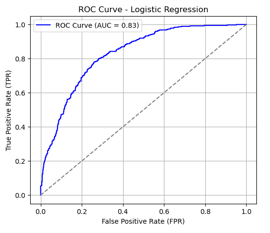

The probability threshold is default (0.5). This means > 0.5 is churn, while below < 0.5 is not churn. We can find out the best threshold with the Youden's J method. The best threshold is 0.535.

```python
# Youden’s J statistic (TPR - FPR)
youden_index = tpr - fpr

# best threshold from highest Youden's J
best_threshold = thresholds[np.argmax(youden_index)]

print(f'Best threshold from roc curve: {best_threshold:.3f}')
```

The impact of increasing this threshold is to decrease recall, increase precision, and also increase F1 Score. This is useful if our model is initially quite good (in the case of churn, seen from recall) and we want to increase spending efficiency. This is because recall ignores false positives (our prediction of a customer is churn, but in reality they do not churn). If the false positive is high, we waste money on customers who do not churn. While precision does not ignore false positives, therefore we must increase the precision value of our model as well.

Below is **the confusion matrix with default threshold**:

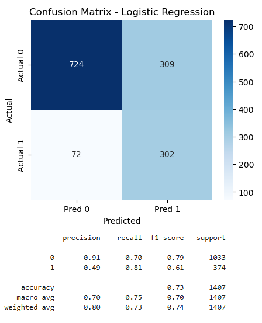

Meanwhile, below is **the confusion matrix with a threshold of 0.535**:

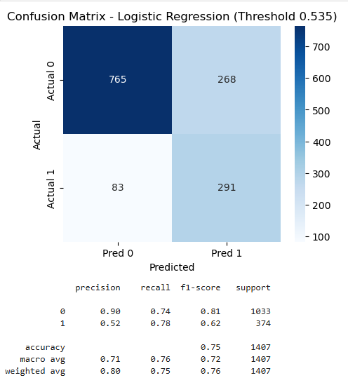

| Threshold         | Recall | Precision | F1 Score | False Negative (FN) | False Positive (FP) |
|------------------|--------|-----------|----------|----------------------|----------------------|
| Default (0.5)    | 0.81   | 0.49      | 0.61     | 72                   | 309                  |
| 0.535           | 0.78   | 0.52      | 0.62     | 83                   | 268                  |

With a higher threshold, false negative is higher than before and false positive is lower. This means that we can more often mispredict customers who did not churn but actually did. However, we can also lower mispredict customers who we predict churn but actually didn't. A slight decrease in recall, but an increase in F1 Score which means our model is better at distinguishing churners from non-churners, and also an increase in precision, this means that there is a fairly good trade-off, especially if we really want to improve spending efficiency.

After finishing the model, we certainly also want to know what factors influence whether or not customers will churn. We can create feature importance with SHAP.

```python
import shap
import matplotlib.pyplot as plt


explainer = shap.Explainer(rs.best_estimator_, X_train_scaled)


shap_values = explainer(X_test_scaled)


shap.summary_plot(shap_values, X_test_scaled, feature_names=X_train.columns)
```


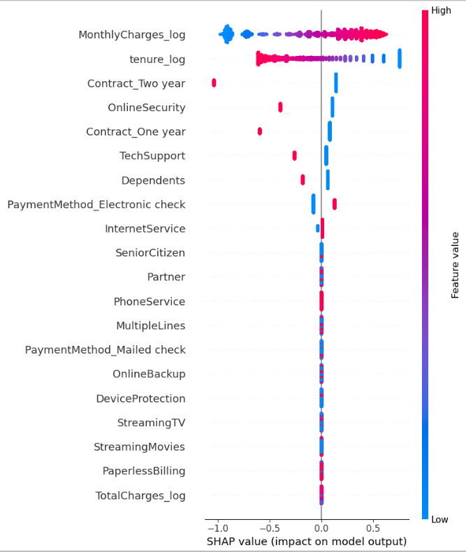

From the testing data, we can see that MonthlyCharge and Tenure are the factors that most influence churn. The higher the monthly fee, the higher the tendency for people to churn, while the longer people subscribe, the lower the tendency for people to churn.

We can also check the probability of each customer to churn. The code is:
```python
# Add customerID to dataframe data testing
df_test = X_test.copy()
df_test["customer_id"] = df_id.loc[X_test.index, "customerID"]

# Add actual churn for the Y
df_test["actual_churn"] = y_test

# Predict probability
df_test["churn_probability"] = rs.best_estimator_.predict_proba(X_test_scaled)[:, 1]

# Churn prediction based on best_threshold
df_test["churn_prediction"] = (df_test["churn_probability"] >= best_threshold).astype(int)
```

And then the result will be like this:
| customer_id  | actual_churn | churn_probability | churn_prediction |
|-------------|-------------|-------------------|------------------|
| 0604-THJFP  | 0           | 0.169396          | 0                |
| 4059-IIEBK  | 0           | 0.716914          | 1                |
| 2228-BZDEE  | 0           | 0.100577          | 0                |
| 2839-RFSQE  | 1           | 0.528642          | 0                |
| 5360-LJCNJ  | 0           | 0.303581          | 0                |

We can see that there is a difference between actual_churn and churn_probability and churn_prediction. The reason is because our prediction model is not 100% accurate (as we know that the result of our recall model is 0.81) and also because of the threshold we set (you can see the difference between actual_churn and churn_prediction. This is very reasonable. With these results, we can also segment customers to see which customers are very susceptible to churn compared to others. These results can also help us do other analysis.

# THANK YOU!